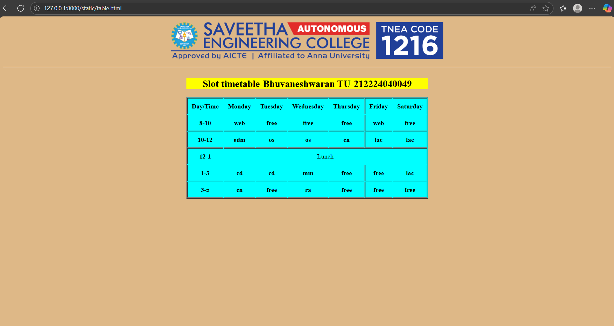

# Ex03 Time Table
## Date: 19.09.2025

## AIM
To write a html webpage page to display your slot timetable.

## ALGORITHM
### STEP 1
Create a Django-admin Interface.

### STEP 2
Create a static folder and inert HTML code.

### STEP 3
Create a simple table using ```<table>``` tag in html.

### STEP 4
Add header row using ```<th>``` tag.

### STEP 5
Add your timetable using ```<td>``` tag.

### STEP 6
Execute the program using runserver command.

## PROGRAM
```
<!DOCTYPE html>
<html>
    <head>

    </head>
    <body>
        <center></center>
        <hr>
        <table border="1" cellpadding="10" align="center" bgcolor="cyan">
            <caption>
                <h2>
                    Slot timetable-Bhuvaneshwaran TU-212224040049
                </h2>
                <tr><th>Day/Time</th><th>Monday</th><th>Tuesday</th><th>Wednesday</th><th>Thursday</th><th>Friday</th><th>Saturday</th></tr>
                <tr><th>8-10</th><th>web</th><th>free</th><th>free</th><th>free</th><th>web</th><th>free</th></tr>
                <tr><th>10-12</th><th>edm</th><th>os</th><th>os</th><th>cn</th><th>lac</th><th>lac</th></tr>
                <tr><th>12-1</th><td colspan="6" align="center">Lunch</td></tr>
                <tr><th>1-3</th><th>cd</th><th>cd</th><th>mm</th><th>free</th><th>free</th><th>lac</th></tr>
                <tr><th>3-5</th><th>cn</th><th>free</th><th>ra</th><th>free</th><th>free</th><th>free</th></tr>
            </caption>
        </table>
    </body>
</html>
<style>
    h2{
        background-color: yellow;
    }
    body{
        background-color: burlywood;
    }
</style>
```

## OUTPUT



## RESULT
The program for creating slot timetable using basic HTML tags is executed successfully.
